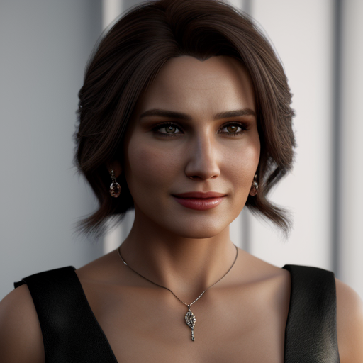

# Text-to-Image Generator

Selamat datang di proyek **Text-to-Image Generator** ini! Program yang dibuat untuk mereka yang lebih suka duduk santai dan membiarkan komputer bekerja keras. Cukup masukkan teks, pilih model, dan voila! Gambar dihasilkan untuk Anda tanpa perlu usaha ekstra. Siapa yang butuh kreativitas saat kita bisa meminta mesin melakukan semuanya?

## Deskripsi

Program ini dirancang untuk mengubah teks sederhana menjadi gambar yang menarik. Dengan menggunakan API tertentu, Anda dapat menghasilkan gambar dari teks yang Anda masukkan. Sangat mudah, bukan? Tanpa perlu berpikir keras, Anda bisa mendapatkan hasil yang memuaskan. Mengapa kode berantakan? Saya sedang malas untuk membuatnya rapih, yang penting berhasil dan berjalan dengan baik, bukan?

Program menggunakan Rest API `https://api.neoxr.eu`, jadi anda perlu membayar untuk mendapatkan API Key. Harga nya sekitar 5k rupiah untuk 5k limit dalam periode 1 bulan.

### Fitur Utama:
- Menghasilkan gambar berdasarkan input teks.
- Menyimpan gambar dengan nama file yang relevan (tanpa banyak basa-basi).
- Menampilkan animasi loading.
- Menyimpan hasil dalam folder yang teratur. Anda tidak perlu repot-repot mencari file yang dihasilkan; semuanya sudah siap untuk Anda!

## Cara Penggunaan

1. Pastikan Anda memiliki PHP terinstal di sistem Anda.
2. Unduh atau clone repositori ini.
3. Beli API Key di `https://api.neoxr.eu/` lalu masukkan API Key anda dalam file GenIMG.php baris ke-5.
4. Jalankan file PHP ini menggunakan terminal.
5. Masukkan teks yang ingin Anda ubah menjadi gambar.
6. Pilih model dan sampler (default: 4).
7. Lihat hasilnya di folder yang telah ditentukan.

Kelebihan? Program ini dapat menghasilkan gambar tanpa sensor atau bisa dikatakan... Anda dapat membuat apa saja tanpa batasan (kecuali limit API Key). Hahaha...

Anda juga dapat menemukan beberapa contoh gambar di folder `Result/GenIMG/` setelah Anda menjalankan program ini. Kenapa repot-repot mencari inspirasi sendiri jika Anda bisa mendapatkan gambar dengan cepat?

## Prasyarat

- PHP 7.0 atau lebih tinggi
- Koneksi internet (untuk API)
- Mungkin beberapa pengaturan lainnya, tetapi siapa yang peduli?

## Lisensi

Proyek ini tidak terlalu serius, dan Anda bebas menggunakannya. Nikmati!

---

**P.S.** Saya akan menambahkan file foto hasil dari program ini, jadi Anda bisa melihat betapa mudahnya mendapatkan gambar tanpa usaha. 

Sekian, selamat menikmati! 😴

## Contoh Hasil
Berikut adalah contoh hasil dari program:

